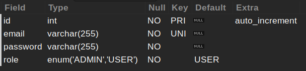
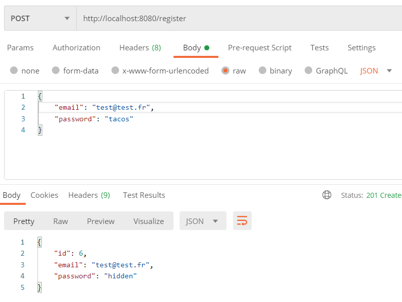
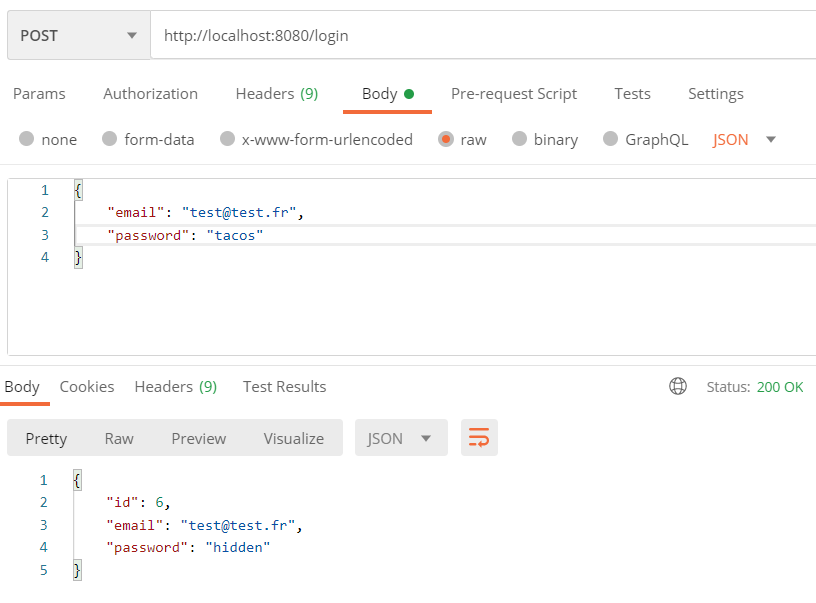
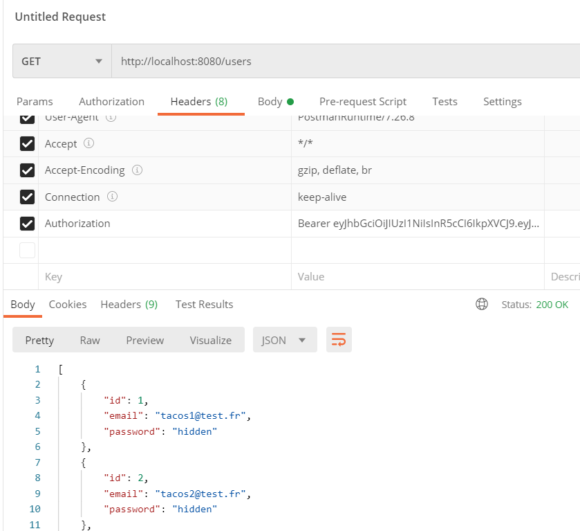

_Fork_ ce _boilerplate_ avant de démarrer le tutoriel !

Installe le projet avec la commande :

```bash
npm run setup
```

# Backend

## 0 - Configuration

### Base de données

Afin de gérer l'inscription et la connexion d'utilisateurs, crée une nouvelle base de données nommée `jwtcourse` et importe le script `backend/database.sql` afin de recréer la table `user` suivante :



### Variables d'environnements

Dans le dossier `backend`, copie le fichier `.env.sample` vers `.env` et modifie les variables d'environnements correspondantes à la base de données.

### Exécution

Tu pourras démarrer le projet avec la commande :

```bash
npm run dev
```

## 1 - Création d'un compte utilisateur

Modifie la route en POST `/users/register` qui va permettre la création d'un compte utilisateur.

La route doit récupérer du corps de la requête un json à la structure suivante :

```json
{
  "email": "son email",
  "password": "son mot de passe",
  "name": "son nom"
}
```

Si l'email ou le mot de passe ne sont pas renseignés, renvoyer une erreur 400 'Please specify both email and password'.

Dans le cas où ils sont renseignés, faire une requête à la base de données et insérer les données dans la table `user`.

Si une erreur survient lors de l'exécution de la requête SQL, renvoyer une erreur 500 avec le message d'erreur correspondant.

Si tout c'est bien passé, renvoyer un code 201 avec un json ayant la structure suivante :

```json
{
  "id": "son id",
  "email": "son email",
  "name": "son nom"
}
```

> Ne pas renvoyer le mot de passe renseigné

Teste le tout avec Postman :

- POST http://localhost:5000/users/register
- Body / raw / JSON
- Dans le corps de la requête un JSON, par exemple :

```json
{
  "email": "test@test.fr",
  "password": "tacos",
  "name": "Michel"
}
```



### Solution

> **Attention** : essaie de faire l'exercice par toi-même avant de regarder la solution !

-
-
-
-
-
-
-
-
-
-
-
-

```js
// src/controllers/UserController.js

  static register = async (req, res) => {
    const { email, password, name } = req.body;

    if (!email || !password) {
      res.status(400).send({ error: "Please specify both email and password" });
      return;
    }

    models.user
      .insert({ email, password, name })
      .then(([result]) => {
        res.status(201).send({ id: result.insertId, email, name });
      })
      .catch((err) => {
        console.error(err);
        res.status(500).send({
          error: err.message,
        });
      });
  };
```

## 2 - Hashage du mot de passe

Il est très dangereux de laisser le mot de passe de l'utilisateur _en clair_ dans une base de données.

Regarde le lien suivant pour voir comment _hasher_ le mot de passe avec la bibliothèque _argon2_ : [https://github.com/ranisalt/node-argon2#node-argon2](https://github.com/ranisalt/node-argon2#node-argon2).

Installe le module [argon2](https://www.npmjs.com/package/argon2) dans ton projet.

Ensuite modifie ta route `/users/register` pour crypter le mot de passe de façon synchrone, **avant** qu'il ne soit enregistré dans la base de données.

Vérifie que le mot de passe est bien encrypté dans la base de donnée.

> Attention, le module est à installer en backend !

> Pense à importer le module en haut de ton fichier !

### Solution

> **Attention** : essaie de faire l'exercice par toi-même avant de regarder la solution !

-
-
-
-
-
-
-
-
-
-
-
-

```js
// src/controllers/UserController.js

  const argon2 = require("argon2");

  static register = async (req, res) => {
    const { email, password, name } = req.body;

    if (!email || !password) {
      res.status(400).send({ error: "Please specify both email and password" });
      return;
    }

    try {
      const hash = await argon2.hash(password);

      models.user
        .insert({ email, password: hash, name })
        .then(([result]) => {
          res.status(201).send({ id: result.insertId, email, name });
        })
        .catch((err) => {
          console.error(err);
          res.status(500).send({
            error: err.message,
          });
        });
    } catch (err) {
      console.error(err);
      res.status(500).send({
        error: err.message,
      });
    }
  };
```

## 3 - Connexion au compte utilisateur

Créer une route en POST `/users/login` qui va permettre la connexion d'un compte utilisateur.

La route doit récupérer du corps de la requête un json à la structure suivante :

```json
{
  "email": "son email",
  "password": "son mot de passe"
}
```

Si l'email ou le mot de passe ne sont pas renseignés, renvoyer une erreur 400 'Please specify both email and password'.

Dans le cas où ils sont renseignés, faire une requête à la base de données et vérifier que l'email existe bien (**tester l'email uniquement, pas le mot de passe !**).

Si une erreur survient lors de l'exécution de la requête SQL, renvoyer une erreur 500 avec le message d'erreur correspondant.

Si le résultat renvoyé est vide, renvoyer une erreur 403 'Invalid email'.

Si le résultat n'est pas vide, tu vas maintenant vérifier le mot de passe en utilisant la méthode `verify` du module _argon2_. Tu peux trouver un exemple d'utilisation ici : [https://github.com/ranisalt/node-argon2#node-argon2](https://github.com/ranisalt/node-argon2#node-argon2).

> Attention, il faut mettre le mot de passe de la base de données en premier argument, et le mot de passe _en clair_ en second

Si tout le mot de passe est identique, renvoyer un code 200 avec un json ayant la structure suivante :

```json
{
  "id": "son id",
  "email": "son email",
  "name": "son nom"
}
```

Sinon renvoie une erreur 403 avec le message 'Invalid password'.

Teste le tout avec Postman :

- POST http://localhost:5000/users/login
- Body / raw / JSON
- Dans le corps de la requête un JSON, par exemple :

```json
{
  "email": "test@test.fr",
  "password": "tacos"
}
```



### Solution

> **Attention** : essaie de faire l'exercice par toi-même avant de regarder la solution !

-
-
-
-
-
-
-
-
-
-
-
-

```js
// src/models/UserManager.js

  findByMail(email) {
    return this.connection.query(
      `select * from ${UserManager.table} where email = ?`,
      [email]
    );
  }

// src/controllers/UserController.js

  static login = (req, res) => {
    const { email, password } = req.body;

    if (!email || !password) {
      res.status(400).send({ error: "Please specify both email and password" });
    }

    models.user
      .findByMail(email)
      .then(async ([rows]) => {
        if (rows[0] == null) {
          res.status(403).send({
            error: "Invalid email",
          });
        } else {
          const { id, email, password: hashedPassword, name } = rows[0];

          if (await argon2.verify(hashedPassword, password)) {
            res.status(200).send({
              id,
              email,
              name,
            });
          } else {
            res.status(403).send({
              error: "Invalid password",
            });
          }
        }
      })
      .catch((err) => {
        console.error(err);
        res.status(500).send({
          error: err.message,
        });
      });
  };
```

## 4 - Création d'un JSON Web Token

Tu rentres enfin dans le vif du sujet : la génération du JWT grâce à une clef secrète.

Commence par renseigner une clé secrète dans le fichier `.env`. Tu peux générer une clé sécurisée ici : [https://www.grc.com/passwords.htm](https://www.grc.com/passwords.htm).

Ensuite, tu vas utiliser le module [jsonwebtoken](https://www.npmjs.com/package/jsonwebtoken) pour effectuer la génération de la clé :

- installe le module
- utilise la méthode `sign` afin de générer un JWT, en utilisant la clé secrète charchée à partir des variables d'environnement.
- Le _payload_ de la clé sera le json suivant : `json { id: id, name: name }`
- la date d'expiration `expiresIn` sera de une heure.

Génère la clé juste avant de renvoyer utilisateur dans la route `/users/login` et fait en sorte que la structure du JSON soit la suivante :

```json
{
  "id": "son id",
  "email": "son email",
  "name": "son nom",
  "token": "le token généré"
}
```


> Attention, le module est à installer en backend !

> Pense à importer le module en haut de ton fichier !

### Solution

> **Attention** : essaie de faire l'exercice par toi-même avant de regarder la solution !

-
-
-
-
-
-
-
-
-
-
-
-

```js
// src/controllers/UserController.js

  const jwt = require("jsonwebtoken");

  static login = (req, res) => {
    const { email, password } = req.body;

    if (!email || !password) {
      res.status(400).send({ error: "Please specify both email and password" });
    }

    models.user
      .findByMail(email)
      .then(async ([rows]) => {
        if (rows[0] == null) {
          res.status(403).send({
            error: "Invalid email",
          });
        } else {
          const { id, email, password: hashedPassword, name } = rows[0];

          if (await argon2.verify(hashedPassword, password)) {
            const token = jwt.sign(
              { id: id, name: name },
              process.env.JWT_AUTH_SECRET,
              {
                expiresIn: "1h",
              }
            );

            res.status(200).send({
              id,
              email,
              name,
              token,
            });
          } else {
            res.status(403).send({
              error: "Invalid password",
            });
          }
        }
      })
      .catch((err) => {
        console.error(err);
        res.status(500).send({
          error: err.message,
        });
      });
  };
```

## 5 - Afficher la liste des utilisateurs

Créer une route en GET `/users` qui récupère la liste des utilisateurs.

Si une erreur survient lors de l'exécution de la requête SQL, renvoyer une erreur 500 avec le message d'erreur correspondant.

Si tout c'est bien passé, renvoyer un code 200 avec un json ayant la structure suivante :

```json
[
  {
    "id": 1,
    "email": "test@test.fr",
    "name": "Michel"
  },
  {
    "id": 2,
    "email": "tacos@test.fr",
    "name": "tacosman"
  }
]
```

> Pense à supprimer de l'affichage le mot de passe de chaque utilisateur !

### Solution

> **Attention** : essaie de faire l'exercice par toi-même avant de regarder la solution !

-
-
-
-
-
-
-
-
-
-
-
-

```js
// src/controllers/UserController.js

  static browse = (req, res) => {
    models.user
      .findAll()
      .then(([rows]) => {
        res.send(
          rows.map((user) => {
            return {
              id: user.id,
              email: user.email,
              name: user.name,
            };
          })
        );
      })
      .catch((err) => {
        console.error(err);
        res.status(500).send({
          error: err.message,
        });
      });
  };
```

## 6 - Création d'un middleware d'authentification

Afin de protéger la route `/users` pour que seuls les utilisateurs authentifiés puissent y accéder, tu vas utiliser un _middleware_ qui va récupérer l'entête de la requête et y regarder la présence d'un _token_.

Pour cette partie là, ajoute le _middleware_ ci-dessous dans `UserController` :

```js
// src/controllers/UserController.js

  static authenticateWithJsonWebToken = (req, res, next) => {
    if (req.headers.authorization !== undefined) {
      const token = req.headers.authorization.split(' ')[1];
      jwt.verify(token, process.env.JWT_AUTH_SECRET, (err) => {
        if (err) {
          res
            .status(401)
            .json({ error: "you're not allowed to access these data" });
        } else {
          next();
        }
      });
    } else {
      res
        .status(401)
        .json({ error: "you're not allowed to access these data" });
    }
  };
```

Tu vas devoir modifier la route `/user` dans `src/router.js`, afin qu'elle charge ce _middleware_.

Teste ensuite la route avec Postman, en renseignant l'entête suivante : `Authorization: Bearer eyJhbG.. ...8RvKts`

Bien sûr, il faudra remplacer le _token_ par celui récupéré lors de la connexion de l'utilisateur dans l'étape 4.



### Solution

> **Attention** : essaie de faire l'exercice par toi-même avant de regarder la solution !

-
-
-
-
-
-
-
-
-
-
-
-

```js
// src/router.js

const {
  authenticateWithJsonWebToken,
} = require("./controllers/UserController");

router.get("/users", authenticateWithJsonWebToken, UserController.browse);
```

# Frontend

## 0 - Configuration

Dans le dossier `backend`, copie le fichier `.env.sample` vers `.env`.

## 1 - Formulaire de connexion

La première étape consistera à créer un formulaire qui permettra à un utilisateur de se connecter au backend réalisé précédemment.

Ouvre la page `Login` et crée un formulaire **contrôlé** contenant :

- un champ pour **email**
- un champ pour **password**
- un bouton permettant d'envoyer le formulaire

Crée une fonction `handleSubmit` liée à l'envoie du fomulaire :

- si l'email ou le mot de passe n'est pas renseigné, affiche une boîte d'alerte avec le message "Please specify both email and password"
- sinon, affiche la valeur des email et mot de passe avec un `console.log`

### Solution

> **Attention** : essaie de faire l'exercice par toi-même avant de regarder la solution !

-
-
-
-
-
-
-
-
-
-
-
-

```js
import { useState } from "react";

const Login = () => {
  const [email, setEmail] = useState("");
  const [password, setPassword] = useState("");

  const handleSubmit = (event) => {
    event.preventDefault();
    if (email && password) {
      console.log(email, password);
    } else {
      alert("Please specify both email and password");
    }
  };

  return (
    <form>
      <label htmlFor='email'>
        Email:
        <input
          type='email'
          name='email'
          id='email'
          placeholder='test@blabla.com'
          value={email}
          onChange={(e) => setEmail(e.target.value)}
        />
      </label>
      <br />
      <label htmlFor='password'>
        Password:
        <input
          type='password'
          name='password'
          id='password'
          placeholder='***********'
          value={password}
          onChange={(e) => setPassword(e.target.value)}
        />
      </label>
      <br />
      <button type='button' onClick={handleSubmit}>
        Login
      </button>
    </form>
  );
};

export default Login;
```

## 2 - Appel du serveur

Maintenant que ton formulaire est prêt, tu vas contacter le serveur afin qu'il te réponde si l'utilisateur est bien connecté.

Installe le module `axios` et modifie la fonction `handleSubmit` afin d'appeler la route `/users/login` de ton serveur, en utilisant la variable d'environnement pour l'url du serveur.

> Attention, le module est à installer en frontend !

Tu peux récupérer une variable d'environnement de la façon suivante :

```js
import.meta.env.VITE_BACKEND_URL;
```

Pense que les _email_ et _password_ seront envoyé dans le corps de la requête, tu verras un exemple ici : [https://kapeli.com/cheat_sheets/Axios.docset/Contents/Resources/Documents/index](https://kapeli.com/cheat_sheets/Axios.docset/Contents/Resources/Documents/index) (dans la section _POST request_).

Si une erreur est récupérée, affiche une boîte d'alerte avec le message correspondant. Il s'agit de la méthode `catch` dont tu peux voir l'utilisation dans la ressource partagée juste avant.

Une fois le contenu de la réponse récupéré, affiche le résultat avec un `console.log`. Si le résultat ressemble au code suivant, c'est gagné :

```json
{
  "id": "son id",
  "email": "son email",
  "token": "le token généré"
}
```

> Attention, vérifie bien que ton serveur backend est lancé !

### Solution

> **Attention** : essaie de faire l'exercice par toi-même avant de regarder la solution !

-
-
-
-
-
-
-
-
-
-
-
-

```js
const handleSubmit = (event) => {
  event.preventDefault();
  if (email && password) {
    axios
      .post(`${import.meta.env.VITE_BACKEND_URL}/users/login`, {
        email,
        password,
      })
      .then((res) => res.data)
      .then((data) => {
        console.log(data);
      })
      .catch((err) => {
        alert(err.response.data.error);
      });
  } else {
    alert("Please specify both email and password");
  }
};
```

## 3 - Sauvegarde du JSON Web Token

Maintenant que le JWT a bien été reçu, il va falloir le stocker lors de la connexion de l'utilisateur : c'est-à-dire au moment où tu fais actuellement le `console.log` du résultat de l'appel d'axios.

Utilise le **local storage** pour enregistrer dans la clé "TOKEN" la valeur de propriété `token` du JSON reçue.

Tu peux voir comment enregistrer une valeur dans le _local storage_ ici : [https://developer.mozilla.org/en-US/docs/Web/API/Storage/setItem](https://developer.mozilla.org/en-US/docs/Web/API/Storage/setItem).

Ensuite, affiche une boîte d'alerte avec le message "Logged successfully".

### Solution

> **Attention** : essaie de faire l'exercice par toi-même avant de regarder la solution !

-
-
-
-
-
-
-
-
-
-
-
-

```js
const handleSubmit = (event) => {
  event.preventDefault();
  if (email && password) {
    axios
      .post(`${import.meta.env.VITE_BACKEND_URL}/users/login`, {
        email,
        password,
      })
      .then((res) => res.data)
      .then((data) => {
        localStorage.setItem("TOKEN", data.token);
        alert("Logged successfully");
      })
      .catch((err) => {
        alert(err.response.data.error);
      });
  } else {
    alert("Please specify both email and password");
  }
};
```

## 4 - Page authentifiée : liste des utilisateurs

Passe maintenant dans la page `Users`.

Le but de cette page est d'afficher la liste des utilisateurs.

La première étape va être de récupérer le "TOKEN" stocké dans le _local storage_. Tu trouvera ton bonheur ici :[https://developer.mozilla.org/en-US/docs/Web/API/Storage/getItem](https://developer.mozilla.org/en-US/docs/Web/API/Storage/getItem).

Ensuite, tu vas devoir modifier la fonction `useEffect` afin de faire un appel avec `axios` à la route `/users`. Cette route étant authentifiée par JWT, l'appel vas avoir besoin d'un **header** qui doit aura la forme suivante :

```js
{
  headers: {
    Authorization: `Bearer ${token}`,
  },
}
```

Tu trouveras comment envoyer des _headers_ avec _axios_ sur le lien suivant : [https://masteringjs.io/tutorials/axios/headers](https://masteringjs.io/tutorials/axios/headers). Fait en sorte de modifier l'exemple pour qu'il ressemble au code ci-dessus.

Si tout se passe bien, modifie le _state_ de `users` et la liste des utilisateurs devrait s'afficher.

S'il y a une erreur (dans la méthode `catch`), vérifie le _status code_ (`error.response.status`). S'il est égal à 401, cela veut dire que la personne n'est pas authentifiée. Afficher une boîte d'alerte avec le message "You're not authorized to access these datas". Si ce n'est pas ce code d'erreur, afficher le message d'erreur récupéré dans la réponse.

> Astuce : faire des `console.log` un peu partout pour t'aider si ça ne marche pas.

### Solution

> **Attention** : essaie de faire l'exercice par toi-même avant de regarder la solution !

-
-
-
-
-
-
-
-
-
-
-
-

```js
useEffect(() => {
  const token = localStorage.getItem("TOKEN");
  axios
    .get(`${import.meta.env.VITE_BACKEND_URL}/users`, {
      headers: {
        Authorization: `Bearer ${token}`,
      },
    })
    .then((res) => res.data)
    .then((data) => {
      setUsers(data);
    })
    .catch((err) => {
      let message;
      if (err.response.status === 401) {
        message = "You're not authorized to access these datas";
      } else {
        message = err.response.data.error;
      }
      alert(message);
      console.error(err);
    });
}, []);
```

## 5 - Déconnexion de l'utilisateur

Termine maintenant en allant dans la page `Logout`.

Tu vas gérer la déconnexion de l'utilisateur en supprimant son "TOKEN" du _local storage_ : [https://developer.mozilla.org/en-US/docs/Web/API/Storage/removeItem](https://developer.mozilla.org/en-US/docs/Web/API/Storage/removeItem).

Une fois le _token_ supprimé, tu peux afficher une boîte d'alerte avec le message "Disconnected successfully".

**Bonus:** tu peux aussi créer un formulaire de création de compte pour t'entraîner.

### Solution

> **Attention** : essaie de faire l'exercice par toi-même avant de regarder la solution !

-
-
-
-
-
-
-
-
-
-
-
-

```js
const handleSubmit = (event) => {
  event.preventDefault();
  localStorage.removeItem("TOKEN");
  alert("Disconnected successfully");
};
```

## Bonus 1 - Récupération du payload du JWT

Lorsqu'un utilisateur se connecte, on récupère le token : ce dernier contient un `payload` (des données stockées en JSON).

Utilise la bibliothèque [jwt-decode](https://www.npmjs.com/package/jwt-decode) pour décoder et logger le `payload`, lors de la connexion d'un utilisateur.

## Bonus 2 - Création de compte

Ajoute le contenu nécessaire à la création d'un compte utilisateur.

## Bonus 3 - HTTP Cookies

Plutôt que d'utiliser le localStorage pour gérer les Json Web Token, il est plus sûr d'utiliser les HTTP Cookies.

Change le code afin d'utiliser cette méthode là : [Using Cookies with JWT in Node.js](https://dev.to/franciscomendes10866/using-cookies-with-jwt-in-node-js-8fn)
