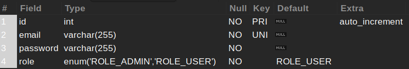
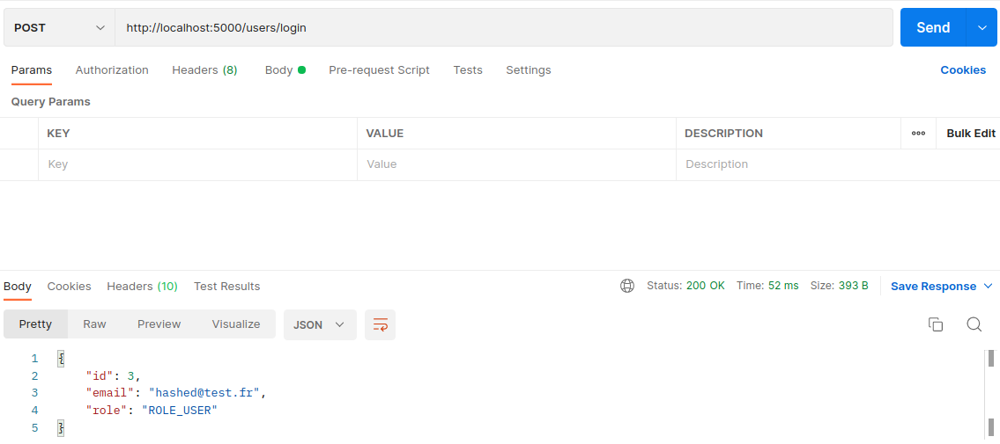
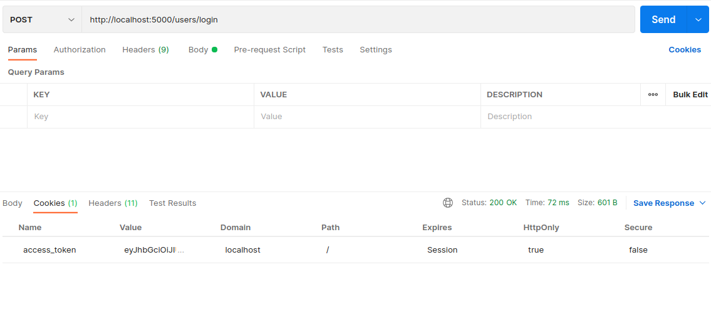
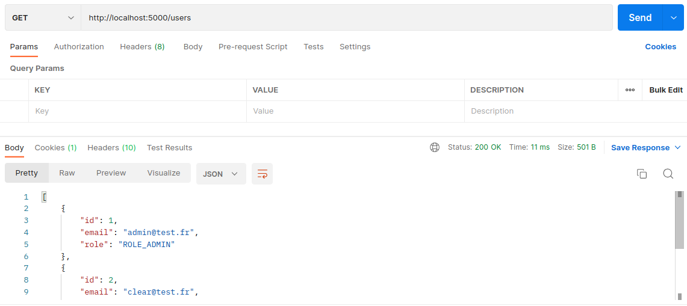
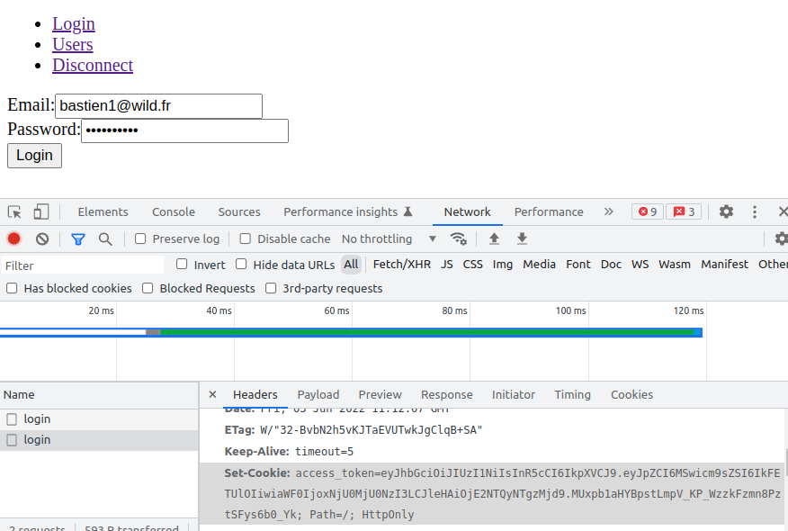

_Fork_ this _boilerplate_ before starting the tutorial!

Install the project with the command:

```bash
npm run setup
```

# Backend

## 0 - Configuration

### Database

In order to manage user registration and login, read then import the SQL file `backend/database.sql` to recreate the following `user` table:



### Environment variables

In the `backend` folder, copy the `.env.sample` file to `.env` and change the environment variables for the database.

### Running

You can start the project with the command:

```bash
npm run dev
```

## 1 - Creating a user account

Modify the POST route `/users/register` which will allow the creation of a user account.

The route must retrieve a json with the following structure from the request body:

```json
{
  "email": "their email",
  "password": "their password",
  "role": "their role, can only be ROLE_USER or ROLE_ADMIN"
}
```

If the email or password are not filled in, return an error 400 'Please specify both email and password'.

By default, the role is `ROLE_USER`.

Query the database and insert the data into the `user` table.

If an error occurs while executing the SQL query, return an error 500 with the corresponding error message.

If all went well, return a 201 code with a json with the following structure:

```json
{
  "id": "their id",
  "email": "their email",
  "role": "their role"
}
```

> Do not send back the password

Test it with Postman:

- POST http://localhost:5000/users/register
- Body / raw / JSON
- In the body of the request a JSON, for example:

```json
{
  "email": "clear@test.fr",
  "password": "tacostacos",
  "role": "ROLE_USER"
}
```


### Solution

> **Warning**: try to do the exercise by yourself before looking at the solution!

-
-
-
-
-
-
-
-
-
-
-
-

```js
// src/controllers/UserController.js

  static register = async (req, res) => {
    const { email, password, role } = req.body;

    if (!email || !password) {
      res.status(400).send({ error: "Please specify both email and password" });
      return;
    }

    models.user
      .insert({ email, password, role })
      .then(([result]) => {
        res.status(201).send({ id: result.insertId, email, role });
      })
      .catch((err) => {
        console.error(err);
        res.status(500).send({
          error: err.message,
        });
      });
  };
```

## 2 - Password hashing

It is very dangerous to leave the user's _clear_ password in a database.

Look at the following link to see how to _hash_ the password with the _argon2_ library: [https://github.com/ranisalt/node-argon2#node-argon2](https://github.com/ranisalt/node-argon2#node-argon2).

Install the [argon2](https://www.npmjs.com/package/argon2) module in your project.

Then modify your `/users/register` route to hash the password, **before** it is stored in the database.

Check that the password is hashed in the database.

> Be careful, the module must be installed in the backend folder

> Remember to import the module at the top of your file

### Solution

> **Warning**: try to do the exercise by yourself before looking at the solution!

-
-
-
-
-
-
-
-
-
-
-
-

```js
// src/controllers/UserController.js

  // Don't forget to import argon2 module

  static register = async (req, res) => {
    const { email, password, role } = req.body;

    if (!email || !password) {
      res.status(400).send({ error: "Please specify both email and password" });
      return;
    }

    try {
      const hash = await argon2.hash(password);

      models.user
        .insert({ email, password: hash, role })
        .then(([result]) => {
          res.status(201).send({ id: result.insertId, email, role });
        })
        .catch((err) => {
          console.error(err);
          res.status(500).send({
            error: err.message,
          });
        });
    } catch (err) {
      console.error(err);
      res.status(500).send({
        error: err.message,
      });
    }
  };
```

## 3 - User account login

Create a POST route `/users/login` that will allow the connection of a user account.

The route must retrieve a json with the following structure from the request body:

```json
{
  "email": "their email",
  "password": "their password"
}
```

If neither the email nor the password are filled in, return a 400 error 'Please specify both email and password'.

If they are both specified, make a request to the database and check that the email exists (**test the email only, not the password!)**.

You'll have to modify the `findByMail` method from `UserManager`.

If an error occurs during the execution of the SQL query, return an error 500 with the corresponding error message.

If the result returned is empty, return a 403 'Invalid email' error.

If the result is not empty, you will now verify the password using the `verify` method of the _argon2_ module. You can find an example here: [https://github.com/ranisalt/node-argon2#node-argon2](https://github.com/ranisalt/node-argon2#node-argon2).

> Be careful, you have to put the database password as the first argument, and the _clear_ password as the second

If all the password is the same, return a 200 code with a json with the following structure:

```json
{
  "id": "their id",
  "email": "their email",
  "role": "their role"
}
```

Otherwise returns a 403 error with the message 'Invalid password'.

Test this with Postman:

- POST http://localhost:5000/users/login
- Body / raw / JSON
- In the body of the request a JSON, for example:

```json
{
  "email": "hashed@test.fr",
  "password": "tacostacos"
}
```



### Solution

> **Warning**: try to do the exercise by yourself before looking at the solution!

-
-
-
-
-
-
-
-
-
-
-
-

```js
// src/models/UserManager.js

  findByMail(email) {
    return this.connection.query(
      `select * from ${UserManager.table} where email = ?`,
      [email]
    );
  }

// src/controllers/UserController.js

  static login = (req, res) => {
    const { email, password } = req.body;

    if (!email || !password) {
      res.status(400).send({ error: "Please specify both email and password" });
    }

    models.user
      .findByMail(email)
      .then(async ([rows]) => {
        if (rows[0] == null) {
          res.status(403).send({
            error: "Invalid email",
          });
        } else {
          const { id, email, password: hash, role } = rows[0];

          if (await argon2.verify(hash, password)) {
            res.status(200).send({
              id,
              email,
              role,
            });
          } else {
            res.status(403).send({
              error: "Invalid password",
            });
          }
        }
      })
      .catch((err) => {
        console.error(err);
        res.status(500).send({
          error: err.message,
        });
      });
  };
```

## 4 - Creating a JSON Web Token

You are finally getting to the heart of the matter: generating the JWT using a secret key.

Start by filling in a secret key in the `.env` file. You can generate a secure key here: [https://www.grc.com/passwords.htm](https://www.grc.com/passwords.htm).

Next, you will use the [jsonwebtoken](https://www.npmjs.com/package/jsonwebtoken) module to perform the key generation:

- install the module
- use the `sign` method to generate a JWT, using the secret key charred from the environment variables.
- The _payload_ of the key will be the following json: `json { id: id, role: role }`
- the expiry date `expiresIn` will be one hour.

Generate the key just before returning user in the `/users/login` route and make the structure of the JSON as follows:

```json
{
  "id": "their id",
  "email": "their email",
  "role": "their role",
  "token": "their JWT token"
}
```

> Be careful, the module has to be installed in the backend folder

> Remember to import the module at the top of your file

### Solution

> **Warning**: try to do the exercise by yourself before looking at the solution!

-
-
-
-
-
-
-
-
-
-
-
-

```js
// src/controllers/UserController.js

  // Don't forget to import jsonwebtoken module

  static login = (req, res) => {
    const { email, password } = req.body;

    if (!email || !password) {
      res.status(400).send({ error: "Please specify both email and password" });
    }

    models.user
      .findByMail(email)
      .then(async ([rows]) => {
        if (rows[0] == null) {
          res.status(401).send({
            error: "Invalid email",
          });
        } else {
          const { id, email, password: hash, role } = rows[0];

          if (await argon2.verify(hash, password)) {
            const token = jwt.sign(
              { id: id, role: role },
              process.env.JWT_AUTH_SECRET,
              {
                expiresIn: "1h",
              }
            );

            res.status(200).send({
              id,
              email,
              role,
              token,
            });
          } else {
            res.status(401).send({
              error: "Invalid password",
            });
          }
        }
      })
      .catch((err) => {
        console.error(err);
        res.status(500).send({
          error: err.message,
        });
      });
  };
```

## 5 - Send JWT via cookies

To be safe, we won't return the JWT in the request body, but inside HTTP cookies.

In `src/app.js`, modify the `cors` configuration to take into account the sending of cookies by the API, by adding the `credentials: true` configuration:

```js
app.use(
  cors({
    origin: process.env.FRONTEND_URL ?? "http://localhost:3000",
    optionsSuccessStatus: 200,
    credentials: true,
  })
);
```

Now that the HTTP cookies are set up, you can modify the `/users/login` route.

Look at the following resource [Using Cookies with JWT in Node.js](https://dev.to/franciscomendes10866/using-cookies-with-jwt-in-node-js-8fn), especially the part about the `/login` route.

Use the resource as inspiration to add the code that will allow you to send a cookie with the response body.

Once done, you can remove the token from the json (it is unnecessary, as it is sent by cookies).



### Solution

> **Warning**: try to do the exercise by yourself before looking at the solution!

-
-
-
-
-
-
-
-
-
-
-
-

```js
  static login = (req, res) => {
    const { email, password } = req.body;

    if (!email || !password) {
      res.status(400).send({ error: "Please specify both email and password" });
    }

    models.user
      .findByMail(email)
      .then(async ([rows]) => {
        if (rows[0] == null) {
          res.status(401).send({
            error: "Invalid email",
          });
        } else {
          const { id, email, password: hash, role } = rows[0];

          if (await argon2.verify(hash, password)) {
            const token = jwt.sign(
              { id: id, role: role },
              process.env.JWT_AUTH_SECRET,
              {
                expiresIn: "1h",
              }
            );

            res
              .cookie("access_token", token, {
                httpOnly: true,
                secure: process.env.NODE_ENV === "production",
              })
              .status(200)
              .send({
                id,
                email,
                role,
              });
          } else {
            res.status(401).send({
              error: "Invalid password",
            });
          }
        }
      })
      .catch((err) => {
        console.error(err);
        res.status(500).send({
          error: err.message,
        });
      });
  };
```

## 6 - Displaying the list of users

Create a GET `/users` route that retrieves the list of users.

If an error occurs during the execution of the SQL query, return an error 500 with the corresponding error message.

If all went well, return a 200 code with a json with the following structure:

```json
[
  {
    "id": 1,
    "email": "clear@test.fr",
    "role": "ROLE_USER"
  },
  {
    "id": 2,
    "email": "hashed@test.fr",
    "role": "ROLE_USER"
  }
]
```

> Remember to remove the password of each user from the display!



### Solution

> **Warning**: try to do the exercise by yourself before looking at the solution!

-
-
-
-
-
-
-
-
-
-
-
-

```js
// src/controllers/UserController.js

  static browse = (req, res) => {
    models.user
      .findAll()
      .then(([rows]) => {
        res.send(
          rows.map((user) => {
            return {
              id: user.id,
              email: user.email,
              role: user.role,
            };
          })
        );
      })
      .catch((err) => {
        console.error(err);
        res.status(500).send({
          error: err.message,
        });
      });
  };
```

## 7 - Creating authentication middleware

In order to protect the `/users` route so that only authenticated users can access it, you will use _middleware_ which will retrieve the _token_ from the cookie sent with the request.

For this part, add the _middleware_ below to the `UserController`:

```js
// src/controllers/UserController.js

  static authorization = (req, res, next) => {
    const token = req.cookies.access_token;
    if (!token) {
      return res.sendStatus(401);
    }
    try {
      const data = jwt.verify(token, process.env.JWT_AUTH_SECRET);
      req.userId = data.id;
      req.userRole = data.role;
      return next();
    } catch {
      return res.sendStatus(401);
    }
  };
```

In order to read cookies with the `req.cookies` command, Express needs the [cookie-parser module](https://www.npmjs.com/package/cookie-parser).

Once the module is installed, modify the `src/app.js` file to import the module and load the _middleware_ with Express:

```js
const cookieParser = require("cookie-parser");
app.use(cookieParser());
```

Then, you'll need to modify the `/user` route in `src/router.js`, so that it loads this _middleware_.

Finally, test the route with Postman (but only after you logged in, since you need the cookie).

### Solution

> **Warning**: try to do the exercise by yourself before looking at the solution!

-
-
-
-
-
-
-
-
-
-
-
-

```js
// src/router.js

const { authorization } = require("./controllers/UserController");

router.get("/users", authorization, UserController.browse);
```

## 8 - Admin route only

The `/users` route checks if the user is logged in with the JWT. But sometimes, you also need to check the role of the user.

Read the code of the `authorization` middleware code: when the JWT is verified, the _paypload_ is also decoded and stored in the request:

```js
const data = jwt.verify(token, process.env.JWT_AUTH_SECRET);
req.userId = data.id;
req.userRole = data.role;
```

The `id` and `role` properties both became available in the next middleware call.

Create a new middleware `isAdmin`, which goes to the next middleware if the user has the role `ROLE_ADMIN`, and sends a `403` response status if the user is not an admin.

Finally, add this middleware to the `/users` route.

### Solution

> **Warning**: try to do the exercise by yourself before looking at the solution!

-
-
-
-
-
-
-
-
-
-
-
-

```js
// UserController.js

  static isAdmin = (req, res, next) => {
    if (req.userRole === "ROLE_ADMIN") {
      return next();
    }
    return res.sendStatus(403);
  };

// src/router.js

const { authorization, isAdmin } = require("./controllers/UserController");

router.get("/users", authorization, isAdmin, UserController.browse);
```

## 9 - Logout

You will have to create a `/logout` route, which removes the `access_token` cookie from the server.

The user will need to be connected to call this route, so you will need to add the `authorization` middleware.

You will have to use the [clearCookie](https://expressjs.com/en/api.html#res.clearCookie) method from Express.

### Solution

> **Warning**: try to do the exercise by yourself before looking at the solution!

-
-
-
-
-
-
-
-
-
-
-
-

```js
// UserController.js

  static logout = (req, res) => {
    return res.clearCookie("access_token").sendStatus(200);
  };

// src/router.js

router.get("/users/logout", authorization, UserController.logout);
```

# Frontend

## 0 - Configuration

In the `frontend` folder, copy the `.env.sample` file to `.env`.

## 1 - Login form

The first step will be to create a form that will allow a user to log into the backend made earlier.

Open the `Login` page and create a **controlled** form containing:

- a field for **email**
- a field for **password**
- an input to submit the form

Creates a `handleSubmit` function linked to the form submission:

- if the email or password is not filled in, displays an alert box with the message "Please specify both email and password"
- otherwise, displays the email and password values with a `console.log`.

### Solution

> **Warning**: try to do the exercise by yourself before looking at the solution!

-
-
-
-
-
-
-
-
-
-
-
-

```js
// src/pages/Login.jsx

import { useState } from "react";

function Login() {
  const [email, setEmail] = useState("");
  const [password, setPassword] = useState("");

  const handleSubmit = (event) => {
    event.preventDefault();
    if (email && password) {
      console.log(email, password);
    } else {
      alert("Please specify both email and password");
    }
  };

  return (
    <form onSubmit={handleSubmit}>
      <label htmlFor='email'>
        Email:
        <input
          type='email'
          name='email'
          id='email'
          placeholder='test@blabla.com'
          value={email}
          onChange={(e) => setEmail(e.target.value)}
        />
      </label>
      <br />
      <label htmlFor='password'>
        Password:
        <input
          type='password'
          name='password'
          id='password'
          placeholder='***********'
          value={password}
          onChange={(e) => setPassword(e.target.value)}
        />
      </label>
      <br />
      <input type='submit' value='Login' />
    </form>
  );
}

export default Login;
```

## 2 - Calling the server

Now that you have your form ready, you will contact the server and have it respond to you if the user is logged in.

Install the `axios` module and modify the `handleSubmit` function to call the `/users/login` route on your server, using the environment variable for the server url.

> Be careful, the module has to be installed in the frontend folder

You can get an environment variable as follows:

```js
import.meta.env.VITE_BACKEND_URL;
```

Think that the _email_ and _password_ will be sent in the body of the request, you can see an example here: [https://kapeli.com/cheat_sheets/Axios.docset/Contents/Resources/Documents/index](https://kapeli.com/cheat_sheets/Axios.docset/Contents/Resources/Documents/index#//dash_ref_General/Entry/POST%20request/0) (in the _POST request_ section).

If an error is catched, it displays an alert box with the corresponding message. This is the `catch` method which you can see used in the shared resource above.

In order to retrieve and store the HTTP Cookies, you have to add an option to your request:

```js
{
  withCredentials: true,
}
```

You can learn more on this matter here: [https://flaviocopes.com/axios-credentials/](https://flaviocopes.com/axios-credentials/).

Once the contents of the response are retrieved, display the result with a `console.log`. If the result looks like the following code, you're in:

```json
{
  "id": "their id",
  "email": "their email",
  "role": "their role"
}
```

> Make sure your backend server is running!

### Solution

> **Warning**: try to do the exercise by yourself before looking at the solution!

-
-
-
-
-
-
-
-
-
-
-
-

```js
// src/pages/Login.jsx

const handleSubmit = (event) => {
  event.preventDefault();
  if (email && password) {
    // don't forget to import the axios module
    axios
      .post(
        `${import.meta.env.VITE_BACKEND_URL}/users/login`,
        {
          email,
          password,
        },
        {
          withCredentials: true,
        }
      )
      .then((res) => res.data)
      .then((data) => {
        console.log(data);
        alert("Successfully logged in");
      })
      .catch((err) => {
        alert(err.response.data.error);
      });
  } else {
    alert("Please specify both email and password");
  }
};
```

## 3 - Check the JSON Web Token

When the user is logged in, you receive the JWT access token in the cookies. You can check this by opening the browser developer toolbar, select the `Network tab`.

Log the user again, and click on the `login` API call.

In the new frame, select the `Headers` tab and if you scroll to the `Set-Cookie` property, you should see the `access_token`.

This cookie will "follow" the user during their navigation, and it will be sent to all future calls of the API.



## 4 - Authenticated page: list of users

Now go to the `Users` page.

The purpose of this page is to display the list of users.

You'll need to modify the `useEffect` function to make a call with `axios` to the `/users` route.
The HTTP cookie will automatically be sent to the API (as long as you added the `withCredentials` property), so you don't have to do anything special.

If all goes well, change the _state_ of `users` and the list of users should appear.

If there is an error (in the `catch` method), check the _status code_ (`error.response.status`) :

- if it equals 401, it means that the person is not authenticated (or the token is expired): display an alert box with the message "You're not authenticated".
- if it equals 403, it means that the person is not an `ROLE_ADMIN`: display an alert box with the message "You're not authorized".

> Tip: make `console.log` everywhere to help you understand what doesn't work.

### Solution

> **Warning**: try to do the exercise by yourself before looking at the solution!

-
-
-
-
-
-
-
-
-
-
-
-

```js
// src/pages/Users.jsx

useEffect(() => {
  axios
    .get(`${import.meta.env.VITE_BACKEND_URL}/users`, {
      withCredentials: true,
    })
    .then((res) => res.data)
    .then((data) => {
      setUsers(data);
    })
    .catch((err) => {
      if (err.response.status === 401) {
        alert("You're not authenticated");
      }
      if (err.response.status === 403) {
        alert("You're not authorized");
      }
      console.error(err);
    });
}, []);
```

## 5 - Logging out the user

Finish now by going to the Logout page.

Call the corresponding API route (still with the `withCredentials` property), and once the _token_ is deleted, you can display an alert box with the message "Disconnected successfully".

You can go a step further and check if a `401` code is sent back (if the user tries to logout without being connected).

### Solution

> **Warning**: try to do the exercise by yourself before looking at the solution!

-
-
-
-
-
-
-
-
-
-
-
-

```js
// src/pages/Logout.jsx

const handleSubmit = (event) => {
  event.preventDefault();
  axios
    .get(`${import.meta.env.VITE_BACKEND_URL}/users/logout`, {
      withCredentials: true,
    })
    .then(() => {
      alert("Successfully logged out");
    })
    .catch((err) => {
      if (err.response.status === 401) {
        alert("You're not authenticated");
      }
    });
};
```

## Bonus - Account creation

Add the form needed to create a user account.
